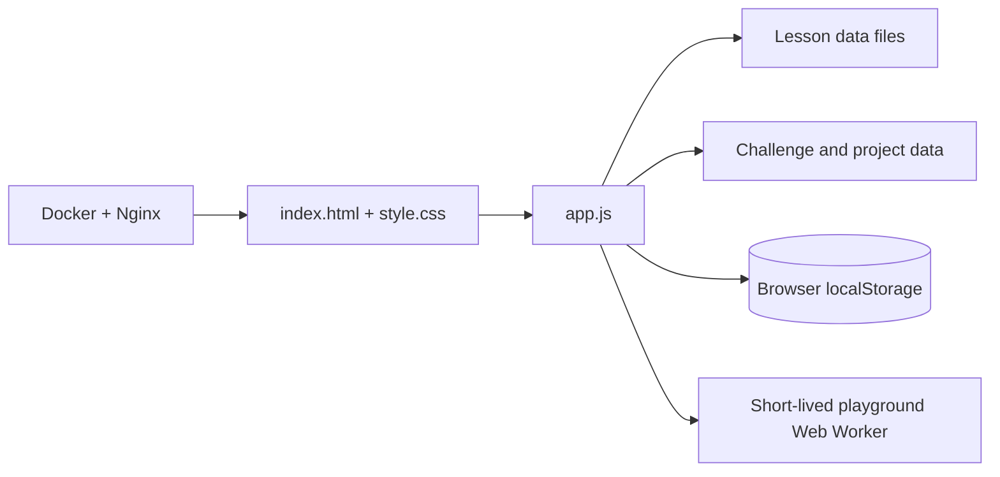

# JSLingo

> Learn JavaScript. Build confidence. Practice safely.

[](https://developer.mozilla.org/en-US/docs/Web/JavaScript)
[](./Dockerfile)
[](./index.html)
[](./LICENSE)

JSLingo is a Persian-first, interactive JavaScript learning lab. It turns a long learning plan into a guided path with short lessons, quizzes, code exercises, networking fundamentals, a REST API project track, and authorized security practice.

The project is deliberately small and transparent: plain HTML, CSS, and JavaScript, no frontend framework, no backend, and no account required.

## What is included

- A progressive JavaScript path covering core syntax, browser APIs, asynchronous code, Node.js concepts, Docker, databases, testing, TypeScript, and delivery workflows.
- Networking fundamentals covering OSI/TCP-IP, DNS, HTTP, TLS, ports, routing, proxies, tools, and defensive concepts.
- Coding challenges for algorithms, data structures, asynchronous patterns, and frontend fundamentals.
- A guided REST API project track with practical architecture and deployment notes.
- A security track with controlled, educational bug-bounty exercises.
- XP, streaks, completion state, and progress stored locally in the browser.
- A responsive dark UI with a local playground that runs snippets in a short-lived Web Worker and stops runaway code.
- A reproducible Nginx/Docker setup with a health endpoint and baseline security headers.

## Quick preview

The main screen combines a focused learning path with progress cards for completion, XP, and the next lesson. Use the sidebar to move between JavaScript, networking, project, security, challenge, practice, and profile areas.

The interface and lesson content are Persian-first so the learning experience stays natural for its intended audience. The repository documentation is in English for easier review and collaboration.

## Architecture



## Quick start with Docker

### Requirements

- Docker Engine
- Docker Compose v2

### Start the app

```bash
docker compose up --build
```

Open the dashboard at [http://localhost:4200](http://localhost:4200).

The container also exposes a small health check:

```bash
curl http://localhost:4200/health
```

Stop the environment with:

```bash
docker compose down
```

## Local development without Docker

JSLingo is a static app, but the browser needs an HTTP origin to load its JavaScript data files. From the repository root, run:

```bash
python3 -m http.server 4173
```

Then open [http://localhost:4173](http://localhost:4173).

There is no package manager step and no build pipeline required for the local version.

## Learning tracks

| Track | Focus |
| --- | --- |
| JavaScript path | Fundamentals through modern browser and Node.js concepts |
| Network fundamentals | Protocols, addressing, DNS, HTTP/TLS, tooling, and defensive concepts |
| Coding challenges | Algorithms, data structures, promises, closures, and frontend patterns |
| REST API project | Practical API structure, authentication, data, tests, and Docker notes |
| Security practice | Authorized, educational exercises for web-security understanding |

## Repository layout

| File | Purpose |
| --- | --- |
| `index.html` | App shell, navigation, metadata, and accessible controls |
| `style.css` | Responsive visual system and component styling |
| `app.js` | State, navigation, progress, lessons, challenges, and playground |
| `lessons-data.js` | JavaScript and security lesson content |
| `network-data.js` | Networking lesson content |
| `challenges-data.js` | General coding challenges |
| `bugbounty-challenges.js` | Authorized security practice challenges |
| `project-data.js` | Guided REST API project notes |
| `Dockerfile` / `docker-compose.yml` | Containerized local hosting |
| `nginx.conf` | Static serving, health check, and response headers |
| `README-FA.md` | خلاصه‌ی فارسی پروژه |

## Data and privacy

JSLingo has no application backend. Learning progress is stored in the browser under the `jslingo-state` localStorage key. The static app does not require an account or a secret key.

Some lessons show example requests, domains, and payloads as teaching material. The examples are synthetic and are not credentials or access to any real system. The playground runs code only when the user explicitly submits it; use it with the same care as any local code runner.

## Safety note

The security material is intended for systems you own or are explicitly authorized to test. Authorization, scope, rate limits, and responsible disclosure remain the operator's responsibility. Do not run the examples against third-party systems without permission.

## Verification

The project is dependency-free. Check every JavaScript file for syntax errors with:

```bash
for file in *.js; do node --check "$file"; done
```

The Docker smoke test should return `ok`:

```bash
docker compose up --build -d
curl -fsS http://localhost:4200/health
docker compose down
```

## Further reading

- [خلاصه‌ی فارسی](./README-FA.md)
- [MIT License](./LICENSE)

## License

Released under the [MIT License](./LICENSE).
